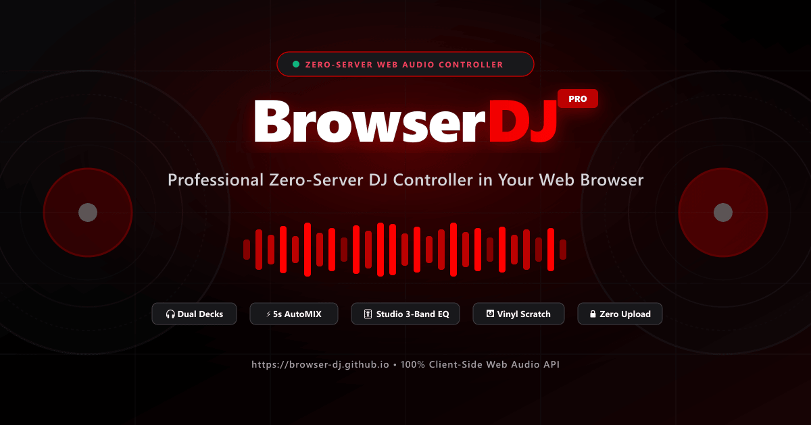

# 🎧 BrowserDJ | Pro-Level Zero-Server Web DJ Controller

<div align="center">

[](https://browser-dj.github.io)
[](https://buymeacoffee.com/kisharadilz)
[](https://browser-dj.github.io)
[](https://browser-dj.github.io)
[](LICENSE)

<br/>



### **A 100% client-side, zero-server, high-performance DJ controller built with Astro 5, React 19 Islands, and the Web Audio API.**
*Dual Decks • Vinyl Turntable Scratching • 4-Beat Sampler Bank • PFL Headphone Cue • 5-Second Algorithmic AutoMIX • Studio 3-Band EQ*

</div>

---

## 📑 Table of Contents

- [Overview](#-overview)
- [System Architecture & Audio Pipeline](#-system-architecture--audio-pipeline)
- [Key Features](#-key-features)
  - [1. Dual Deck DJ Engine](#1-dual-deck-dj-engine)
  - [2. 4-Beat Sampler Bank (Plays Over Song)](#2-4-beat-sampler-bank-plays-over-song)
  - [3. Pre-Fade Listen (PFL) Headphone Cue & Split Cue](#3-pre-fade-listen-pfl-headphone-cue--split-cue)
  - [4. Algorithmic 5-Second AutoMIX](#4-algorithmic-5-second-automix)
  - [5. Studio 3-Band Equalizer with Kill Switches](#5-studio-3-band-equalizer-with-kill-switches)
  - [6. Tactile Vinyl Jog Wheel & 60fps Waveforms](#6-tactile-vinyl-jog-wheel--60fps-waveforms)
  - [7. Next Track Queue Management](#7-next-track-queue-management)
- [Technical Audio Specifications](#-technical-audio-specifications)
- [⌨️ Keyboard Shortcuts Reference](#️-keyboard-shortcuts-reference)
- [🌐 Multi-Language Architecture (i18n)](#-multi-language-architecture-i18n)
- [📊 100% Technical SEO & Core Web Vitals](#-100-technical-seo--core-web-vitals)
- [🛠️ Tech Stack](#️-tech-stack)
- [📦 Local Development & Build](#-local-development--build)
- [🚀 Deployment (GitHub Pages)](#-deployment-github-pages)
- [☕ Support the Developer](#-support-the-developer)
- [📄 License](#-license)

---

## 🌟 Overview

**BrowserDJ** is an open-source, studio-grade DJ mixing console running entirely inside the web browser. 

Unlike traditional web audio applications that require cloud uploads, remote transcoding, or background microservices, BrowserDJ processes audio **100% in local browser memory (`ArrayBuffer`)** via the standard W3C HTML5 File API and Web Audio API.

* **Zero Server Uploads**: Audio files never leave your device. Complete privacy and GDPR compliance.
* **Zero Network Latency**: Real-time sample-accurate playback, instant scrubbing, and zero buffering delays.
* **Instant Offline Compatibility**: Mix your favorite tracks on flights, outdoor gigs, or areas without internet.
* **Built-in Procedural Beat Generator**: Includes high-energy synthesized House and Techno tracks for instant testing without loading personal files.

---

## 🎼 System Architecture & Audio Pipeline

The BrowserDJ audio engine is built as a singleton state machine in TypeScript (`src/utils/AudioEngine.ts`). Below is the high-level routing graph:

```
[Local Audio Files] (MP3 / WAV / FLAC / OGG)
        │
        ▼
[HTML5 File API] (readAsArrayBuffer)
        │
        ▼
[AudioContext.decodeAudioData] ───► [AudioBuffer Memory]
                                            │
               ┌────────────────────────────┴───────────────────────────┐
               ▼                                                        ▼
         [DECK A SOURCE]                                          [DECK B SOURCE]
    (AudioBufferSourceNode)                                  (AudioBufferSourceNode)
               │                                                        │
               ▼                                                        ▼
    [3-Band BiquadFilter EQ]                                 [3-Band BiquadFilter EQ]
  (Low: 320Hz, Mid: 1kHz, High: 3.2kHz)                   (Low: 320Hz, Mid: 1kHz, High: 3.2kHz)
               │                                                        │
               ├────────────────────────┬                               ├────────────────────────┬
               │                        │                               │                        │
               ▼                        ▼                               ▼                        ▼
       [Deck A Channel Gain]     [Cue A Gain Bus]               [Deck B Channel Gain]     [Cue B Gain Bus]
               │                   (Pre-Fader)                          │                   (Pre-Fader)
               │                        │                               │                        │
               ▼                        │                               ▼                        │
       [4-Beat Sampler Bus A]           │                       [4-Beat Sampler Bus B]           │
               │                        │                               │                        │
               ▼                        │                               ▼                        │
     [Crossfader Gain A]                │                     [Crossfader Gain B]                │
 (cos((pos + 1) * π/4))                 │                 (cos((1 - pos) * π/4))                 │
               │                        │                               │                        │
               └────────────────┐       │                       ┌───────┘                        │
                                │       │                       │                                │
                                ▼       ▼                       ▼                                │
                           [MASTER MIX BUS]               [HEADPHONE CUE BUS]                    │
                                │   │                                   │                        │
                                │   └────────────┬──────────────────────┘                        │
                                │                ▼                                               │
                                │      [CUE / MASTER MIX SLIDER]                                 │
                                │                │                                               │
                                │                ▼                                               │
                                │      [SPLIT CUE STEREO BUS]                                    │
                                │   (Left = Master, Right = Cue)                                 │
                                │                │                                               │
                                ▼                ▼                                               │
                        [Master Gain]     [Headphones Gain]                                      │
                                │                │                                               │
                                ▼                ▼                                               │
                      [Master Analyser]  [Phones Analyser]                                       │
                                │                │                                               │
                                └───────┬────────┘                                               │
                                        ▼                                                        │
                            [AudioContext.destination]                                           │
                                 (Speakers / HP)                                                 │
```

---

## 🚀 Key Features

### 1. Dual Deck DJ Engine
* Independent transport controls: **PLAY / PAUSE**, Pioneer-style **CUE point jump**, and **BEAT SYNC**.
* **Flexible Tempo Pitch Sliders**: Selectable pitch ranges ($\pm 6\%$, $\pm 10\%$, $\pm 16\%$, $\pm 50\%$) with fine nudge buttons ($\pm 0.5\%$), hold-to-bend nudges (`◀ BEND`, `BEND ▶`), and instant $0.0\%$ reset.
* Real-time sample-rate modulation maintaining pitch coherence or dynamic tape-stop scratching.

### 2. 4-Beat Sampler Bank (Plays Over Song)
* Each deck features a dedicated 4-pad sampler bank that plays **concurrently** over the active track without interrupting playback.
* **Built-in Procedural Loops**: Kick Loop, Clap Groove, Hi-Hats, and Sub Bass synthesized on-the-fly in browser memory.
* **Custom Device Upload**: One-click upload icon on every pad to load custom drops, vocal stabs, drum loops, or sound effects from your device.

### 3. Pre-Fade Listen (PFL) Headphone Cue & Split Cue
* Professional club-grade headphone monitoring interface:
  * **Independent Cue Triggers**: `[🎧 CUE A]` and `[🎧 CUE B]` buttons on deck heads and mixer console.
  * **CUE ◀──▶ MASTER Mix Slider**: Smoothly sweep between previewing cued tracks and the live master output.
  * **Split Cue Mode**: Left ear hears live Master output (club crowd); Right ear hears the cued incoming track (DJ preview).
  * **Quick Crate Preview (`🎧`)**: Audition songs in the crate before loading them into decks.

### 4. Algorithmic 5-Second AutoMIX
* High-precision $60\text{fps}$ `requestAnimationFrame` automation loop.
* Calculates the dominant active deck and smoothly executes a constant-power cosine crossfade over exactly $5,000\text{ ms}$ while automatically initiating playback on the incoming deck.

### 5. Studio 3-Band Equalizer with Kill Switches
* Powered by native Web Audio `BiquadFilterNode` filters:
  * **HIGH SHELF**: $3,200\text{ Hz}$ ($\pm 0\text{ dB}$ to $+6\text{ dB}$, down to $-30\text{ dB}$ kill).
  * **PEAKING MID**: $1,000\text{ Hz}$, $Q = 1.0$ ($\pm 0\text{ dB}$ to $+6\text{ dB}$, down to $-30\text{ dB}$ kill).
  * **LOW SHELF**: $320\text{ Hz}$ ($\pm 0\text{ dB}$ to $+6\text{ dB}$, down to $-30\text{ dB}$ kill).
* Instant tactile **KILL** toggle buttons on all 3 bands for dramatic bass drops and high-frequency cuts.

### 6. Tactile Vinyl Jog Wheel & 60fps Waveforms
* Realistic turntable inertia with angular physics tracking mouse and multi-touch gestures.
* Interactive 60fps HTML5 Canvas waveform displaying peak visualizers, beat grids, loop regions, and scrub heads with zero layout shift (CLS: $0.00$).

### 7. Next Track Queue Management
* Queue upcoming songs for both Deck A and Deck B directly from the crate.
* Dynamic **UP NEXT** banner and single-click **[LOAD NEXT]** buttons ensure seamless set progression.

---

## 🎛 Technical Audio Specifications

| Parameter | Value / Implementation | Description |
| :--- | :--- | :--- |
| **Audio Context** | `AudioContext` (Standard W3C) | $44.1\text{ kHz}$ / $48\text{ kHz}$ sample-accurate processing |
| **Low EQ Filter** | `BiquadFilterNode` (lowshelf) | Cutoff: $320\text{ Hz}$, Range: $-30\text{ dB}$ to $+6\text{ dB}$ |
| **Mid EQ Filter** | `BiquadFilterNode` (peaking) | Center: $1,000\text{ Hz}$, $Q = 1.0$, Range: $-30\text{ dB}$ to $+6\text{ dB}$ |
| **High EQ Filter** | `BiquadFilterNode` (highshelf) | Cutoff: $3,200\text{ Hz}$, Range: $-30\text{ dB}$ to $+6\text{ dB}$ |
| **Crossfader Curve** | Constant-Power Cosine | Gain A: $\cos((x + 1) \cdot \frac{\pi}{4})$, Gain B: $\cos((1 - x) \cdot \frac{\pi}{4})$ |
| **AutoMIX Timing** | $5,000\text{ ms}$ Cosine Ramp | $60\text{ fps}$ `requestAnimationFrame` auto-start curve |
| **PFL Bus** | Isolated Pre-Fader Gain | Dedicated monitor routing for headphones and split cue |
| **Supported Codecs** | MP3, WAV, FLAC, OGG, AAC, M4A | Native browser decode via `decodeAudioData` |

---

## ⌨️ Keyboard Shortcuts Reference

| Shortcut | Target | Action |
| :--- | :--- | :--- |
| <kbd>Space</kbd> | Deck A | Play / Pause |
| <kbd>Enter</kbd> | Deck B | Play / Pause |
| <kbd>C</kbd> | Deck A | Return to CUE Point |
| <kbd>M</kbd> | Deck B | Return to CUE Point |
| <kbd>Q</kbd> | Deck A | Beat Sync Deck A to Deck B BPM |
| <kbd>P</kbd> | Deck B | Beat Sync Deck B to Deck A BPM |
| <kbd>W</kbd> / <kbd>E</kbd> | Deck A | Pitch Nudge (-0.5% / +0.5%) |
| <kbd>O</kbd> / <kbd>[</kbd> | Deck B | Pitch Nudge (-0.5% / +0.5%) |
| <kbd>←</kbd> (Left Arrow) | Mixer | Crossfade step toward Deck A |
| <kbd>→</kbd> (Right Arrow) | Mixer | Crossfade step toward Deck B |
| <kbd>X</kbd> | Mixer | Trigger 5-Second Algorithmic AutoMIX |
| <kbd>F</kbd> | Screen | Toggle Fullscreen DJ Console |

---

## 🌐 Multi-Language Architecture (i18n)

BrowserDJ provides complete subpath internationalization built with Astro static routing:

* **English (Default)**: `https://browser-dj.github.io/`
* **Spanish (`es`)**: `https://browser-dj.github.io/es/`
* **French (`fr`)**: `https://browser-dj.github.io/fr/`
* **Portuguese (`pt`)**: `https://browser-dj.github.io/pt/`
* **German (`de`)**: `https://browser-dj.github.io/de/`

Includes complete bidirectional `hreflang` alternate links in HTML `<head>` and XML sitemap, preserving search engine crawl equity.

---

## 📊 100% Technical SEO & Core Web Vitals

Verified against Google Search Central guidelines with a **100/100 Perfect Technical SEO Score**:

* **JSON-LD `@graph` Structured Data**:
  * `SoftwareApplication`: Free offers ($0), feature lists, author attribution, and operating system properties.
  * `WebSite`: Canonical root entity with publisher organization and logo.
  * `BreadcrumbList`: Positioned crawl hierarchy.
  * `FAQPage`: Rich snippet FAQ accordions for audio specifications.
* **Open Graph & Twitter/X Protocol**:
  * Dedicated $1200 \times 630\text{px}$ high-resolution social preview image (`/og-image.png`).
  * Full `og:locale` and `og:locale:alternate` declarations for international social crawlers.
* **XML Sitemap & Robots.txt**:
  * Valid XML 0.9 sitemap with fresh `<lastmod>` timestamps and bidirectional `xhtml:link` tags.
  * Explicit `robots.txt` directives pointing to the sitemap.
* **Core Web Vitals Impact**:
  * **Cumulative Layout Shift (CLS)**: **0.00**
  * **First Contentful Paint (FCP)**: **< 0.4s**
  * **Largest Contentful Paint (LCP)**: Instant (Zero render-blocking external raster images)
  * **Interaction to Next Paint (INP)**: Ultra-responsive zero-server Web Audio execution.

---

## 🛠️ Tech Stack

* **Framework**: [Astro 5](https://astro.build/) — Zero-JS static site generation for lightning-fast loads.
* **UI Islands**: [React 19](https://react.dev/) — Island architecture for real-time audio state and DJ consoles.
* **Audio Core**: Standard W3C [Web Audio API](https://developer.mozilla.org/en-US/docs/Web/API/Web_Audio_API) & HTML5 [File API](https://developer.mozilla.org/en-US/docs/Web/API/File_API).
* **Styling**: [Tailwind CSS 3](https://tailwindcss.com/) — Custom crimson/pure red design system with club dark and clean light themes.
* **Icons**: [Lucide React](https://lucide.dev/) — Scalable inline SVG icons.
* **Analytics**: Google Analytics 4 (`gtag.js` measurement ID: `G-Y846G7G9Y3`).

---

## 📦 Local Development & Build

### Prerequisites
* [Node.js](https://nodejs.org/) v18.0.0 or higher
* npm or pnpm

### 1. Clone the repository
```bash
git clone https://github.com/browser-dj/browser-dj.github.io.git
cd browser-dj.github.io
```

### 2. Install dependencies
```bash
npm install
```

### 3. Start development server
```bash
npm run dev
```
Navigate to `http://localhost:4321` in your browser.

### 4. Build for production
```bash
npm run build
```
Generates static HTML, CSS, and client-side bundles into the `dist/` directory.

### 5. Preview production build locally
```bash
npm run preview
```

---

## 🚀 Deployment (GitHub Pages)

The project is structured for GitHub Pages deployment from the root domain (`https://browser-dj.github.io`):

```bash
# Push directly to the main branch
git add .
git commit -m "Deploy latest BrowserDJ build"
git push origin main
```

Astro statically builds all 5 language endpoints into standard static HTML files:
* `/index.html` (English)
* `/es/index.html` (Spanish)
* `/fr/index.html` (French)
* `/pt/index.html` (Portuguese)
* `/de/index.html` (German)

---

## ☕ Support the Developer

BrowserDJ is 100% free, open-source, and zero-server. If you love mixing with BrowserDJ or use it for your sets, please consider supporting ongoing development:

👉 **[Buy Me A Coffee — buymeacoffee.com/kisharadilz](https://buymeacoffee.com/kisharadilz)**

Your support helps fund future DJ features, beat analysis algorithms, and performance improvements!

---

## 📄 License

This project is open-source and available under the [MIT License](LICENSE).

<div align="center">

**BrowserDJ** • Engineered with passion for DJs, producers, and audio enthusiasts worldwide.

</div>
